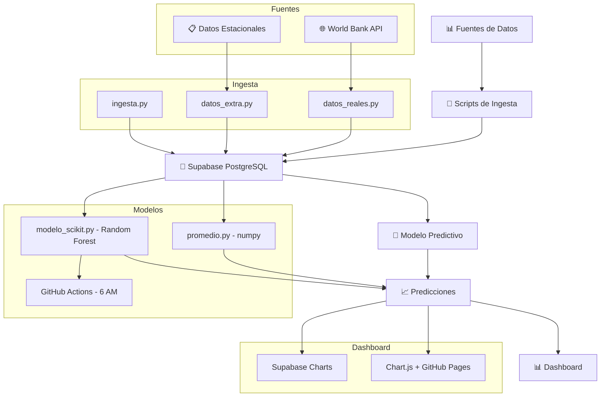
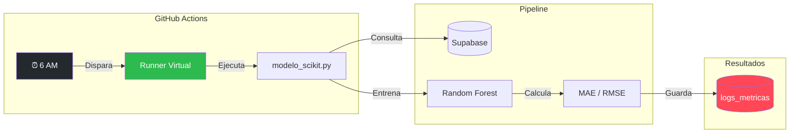
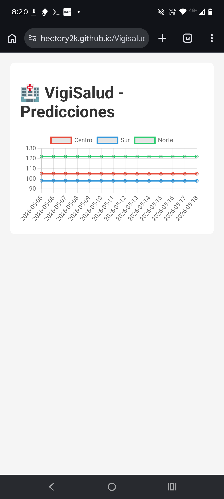

# 🏥 VigiSalud - MVP

Predicción de picos de consultas ortopédicas con datos abiertos y modelos estacionales.  
Desarrollado como proyecto para **Humai** desde un Moto G65.

## 🎯 Objetivo
Anticipar picos de consultas por zona con 1-2 semanas de anticipación para priorizar operativos y recursos en traumatología.

## 📦 Instalación
git clone https://github.com/hectory2k/vigisalud.git
cd vigisalud
pip install -r requirements.txt

## ▶️ Uso rápido
python ingesta.py
python datos_reales.py
python datos_extra.py
python promedio.py

## 🧠 Modelos
promedio.py: Media estacional (numpy) - Manual
modelo_scikit.py: Random Forest + TimeSeriesSplit - Automático (6 AM)

## 📊 Resultados
MAE: 55 consultas
RMSE: 73 consultas
Registros entrenamiento: 54
Zonas: Norte, Sur, Centro

## 🩺 Impacto clínico
El modelo anticipa variaciones de hasta 70 consultas extra en una zona. El hospital puede reforzar la guardia traumatológica y redistribuir recursos antes del pico.

## 🔄 Arquitectura

## ⏰ Orquestación Diaria (GitHub Actions)

## 🌐 Dashboard en vivo
👉 [Ver dashboard público](https://hectory2k.github.io/Vigisalud-dashboard/)

## 📸 Dashboard en acción

*Predicciones diarias por zona generadas automáticamente a las 6 AM.*

## 🛠️ Tecnologías
- Python 3 + numpy + scikit-learn
- Supabase (PostgreSQL)
- Termux (Moto G65)
- Azure App Service
- Chart.js + GitHub Pages

## 🧭 Filosofía del proyecto

Estos principios guiaron el desarrollo de VigiSalud desde un Moto G65, sin presupuesto y con foco en impacto real:

| Principio | Por qué importa |
|-----------|-----------------|
| 🩺 **Doble validación (médico + estudiante de ingenieria en iA)** | El pipeline responde a una necesidad clínica real y está técnicamente validado |
| 📱 **Sin compu no es excusa** | Termux + GitHub Actions = producción. El entorno no limita, obliga a ser eficiente |
| 💰 **Costo cero, impacto máximo** | Stack 100% gratuito: Supabase, GitHub, World Bank API |
| 🧠 **KISS no es simplismo** | Arquitectura modular donde cambiar de algoritmo requiere una sola línea |

## 👤 Autor
Hector | [GitHub](https://github.com/hectory2k)

## 📝 Licencia
MIT
