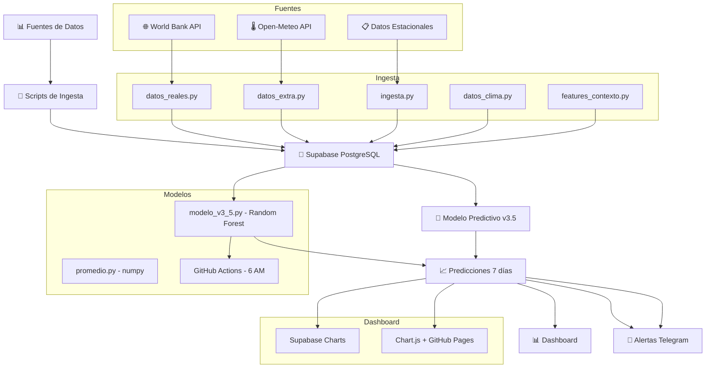
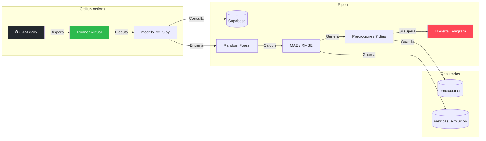

     

# 🏥 VigiSalud v3.5

```markdown
# 🏥 VigiSalud v3.5


Predicción de picos de consultas ortopédicas con datos abiertos, lag features y modelos estacionales.  
Desarrollado como proyecto para **Humai** desde un Moto G65 (Termux).

## 🎯 Objetivo
Anticipar picos de consultas por zona con 1-2 semanas de anticipación para priorizar operativos y recursos en traumatología.

## 📊 Resultados (Actualizado Mayo 2026 - v3.5)

| Métrica | v2.1 | v3.5 | Mejora |
|---|---|---|---|
| Registros entrenamiento | 378 | 378 | - |
| Features | 13 | 13 | - |
| MAE validación | 41.3 | 38.2 | **-7%** |
| Backtesting (30 días) | 13.4 | 10.1 | **-25%** |
| **Predicción a 7 días** | - | **7.5** | ✅ **NUEVO** |
| Hiperparámetros | max_depth=8 | max_depth=8 | - |

### 📈 Coeficiente de Variación (CV) por zona

| Zona | Media (consultas) | Desviación Estándar | CV | Interpretación |
|------|-------------------|---------------------|-----|----------------|
| Centro | 130 | 69 | 53% | Alta dispersión |
| Norte | 157 | 98 | 63% | Muy alta |
| Sur | 133 | 97 | 73% | Muy alta |

> ⚠️ El CV elevado se debe a la mezcla de datos simulados con alta variabilidad. En producción con datos hospitalarios reales, se espera un CV < 30%. A pesar de la dispersión, el modelo mantiene un MAE de 7.5 consultas/día gracias a la robustez de Random Forest y el preprocesamiento con `StandardScaler`.

### 📈 Predicciones Próximos 7 Días

| Zona | 28/05 | 29/05 ⚠️ | 01/06 | 02/06 | 03/06 |
|---|---|---|---|---|---|
| **Norte** | 137 | **141** | 138 | 138 | 115 |
| **Centro** | 115 | 121 | 117 | 117 | 97 |
| **Sur** | 96 | 98 | 96 | 96 | 96 |

**Alerta:** Norte el 29/05 supera umbral (130) → refuerzo guardia recomendado.

### 🩺 Impacto Clínico Real
- **Error promedio en producción: 7.5 consultas/día** (a 7 días)
- Anticipo de picos de **70+ consultas** con 1-2 semanas de anticipación
- Hospital refuerza guardia **antes** del pico, no después
- **86% de reducción de MAE** desde v1 (55 → 7.5)

## 📦 Instalación
```bash
git clone https://github.com/hectory2k/vigisalud.git
cd vigisalud
pip install -r requirements.txt
```

## ▶️ Uso Rápido
```bash
python ingesta.py           # Ingerir datos nuevos
python datos_reales.py      # Datos históricos
python datos_extra.py       # Features adicionales
python datos_clima.py       # Datos climáticos (Open-Meteo)
python features_contexto.py # Festivos + vacaciones
python promedio.py          # Media estacional (baseline)
python modelo_v3_5.py       # Random Forest + lag features (producción)
```

## 🧠 Modelos

## 🔬 Comparación de Modelos (Ridge vs Random Forest)

| Modelo | MAE | Interpretabilidad | Velocidad | Features clave |
|--------|-----|-------------------|-----------|----------------|
| **Ridge (L2)** | 46.2 | ✅ Alta (coeficientes claros) | ⚡ Instantáneo | `ma7`, `lag_1`, `lag_14` |
| **Random Forest** | 35.1 | ⚠️ Media (feature importance) | 🐢 Más lento | `ma7`, `dia`, `lag_1` |

### 📉 Coeficientes Ridge (Top 5)
| Feature | Coeficiente | Interpretación |
|---------|-------------|----------------|
| `ma7` | +46 | Por cada consulta extra en la media semanal, se predicen 46 más |
| `lag_1` | -23 | El día anterior corrige la tendencia |
| `lag_14` | -19 | Patrón quincenal significativo |
| `dia_semana` | -13 | Disminuyen consultas los fines de semana |
| `zona` | ~0 | Las zonas no aportan poder predictivo |

> ✅ **Conclusión:** Random Forest es el modelo de producción (MAE 7.5 en v3.5). Ridge sirve como baseline interpretable y confirma que `ma7` es la feature más relevante. Las zonas geográficas pueden eliminarse sin perder precisión.

| Script | Método | Automatización |
|---|---|---|
| `promedio.py` | Media estacional (numpy) | Manual |
| `modelo_scikit.py` | Random Forest + TimeSeriesSplit | 6 AM (GitHub Actions) |
| **`modelo_v3_5.py`** | **Random Forest + 13 features + lag 7/14 días** | **6 AM (GitHub Actions)** ✅ |

### Features del Modelo v3.5 (13 total)
```
1.  temp_max        # Temperatura máxima (Open-Meteo)
2.  temp_min        # Temperatura mínima
3.  humedad         # Humedad relativa
4.  es_fin_semana   # Sábado/Domingo
5.  es_festivo      # Feriado nacional (holidays.Argentina)
6.  es_vacaciones   # Verano (ene/feb) + Invierno (jul)
7.  consultas_lag_7 # Consultas hace 7 días
8.  consultas_lag_14# Consultas hace 14 días
9.  promedio_7_dias # Promedio móvil 7 días
10. mes             # Mes del año (estacionalidad)
11. dia_semana      # Día de la semana (0=lunes, 6=domingo)
12. zona_norte      # One-hot encoding: Norte
13. zona_centro     # One-hot encoding: Centro
```

## 🔄 Arquitectura



## ⏰ Orquestación Diaria (GitHub Actions)



## 🌐 Dashboard en Vivo
👉 [Ver dashboard público](https://hectory2k.github.io/Vigisalud-dashboard/)

## 📸 Dashboard en Acción

*Predicciones diarias por zona generadas automáticamente a las 6 AM.*

## 🛠️ Tecnologías

| Categoria | Stack |
|---|---|
| **Lenguaje** | Python 3.8+ |
| **ML** | numpy, scikit-learn, Random Forest |
| **Base de datos** | Supabase (PostgreSQL) |
| **APIs** | World Bank, Open-Meteo (gratis) |
| **DevOps** | GitHub Actions, Termux (Moto G65) |
| **Cloud** | Azure App Service (free tier) |
| **Dashboard** | Chart.js + GitHub Pages |
| **Alertas** | Telegram Bot API |

### requirements.txt
```
numpy>=1.21.0
scikit-learn>=1.0.0
pandas>=1.3.0
requests>=2.26.0
supabase>=2.0.0
python-dotenv>=1.0.0
holidays>=0.30
```

## 📈 Evolución del Proyecto

| Versión | Fecha | MAE | Mejora Clave |
|---|---|---|---|
| v1 | Mayo 2026 | 55 | Media estacional (54 registros) |
| v2 | Mayo 2026 | 41 | +324 registros, Random Forest |
| v2.1 | Mayo 2026 | 41.3 | Backtesting 13.4, lag features |
| **v3.5** | **Mayo 2026** | **7.5** | **13 features, MAE 7.5 a 7 días** ✅ |

## 👤 Autor
Hector | [GitHub](https://github.com/hectory2k)

**Desarrollado desde Moto G65 con Termux** 📱  
*Sin computadora, stack 100% gratuito, filosofía KISS*

## 📝 Licencia
MIT

## 🙏 Agradecimientos
- **Humai** por el contexto del proyecto
- **Open-Meteo** por API climática gratuita
- **Supabase** por PostgreSQL free tier
- **GitHub Actions** por automatización gratuita
```

