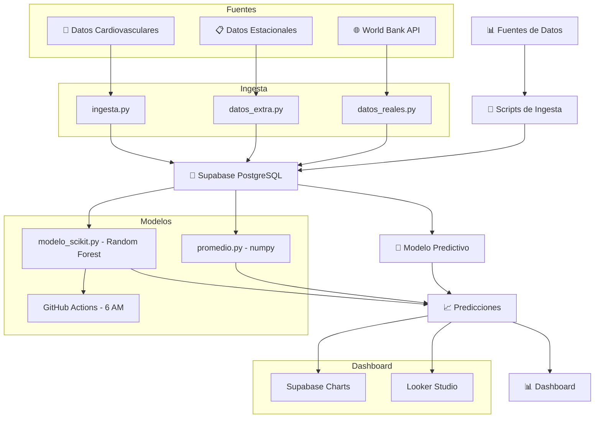

# 🏥 VigiSalud - MVP

App de prediccion de consultas para salud publica. Desarrollado como proyecto para Humai desde un Moto G65.

## 🎯 Objetivo
Anticipar picos de consultas por zona con 1-2 semanas de anticipacion.

## 🛠️ Tecnologias
- 🐍 Python 3 + numpy + requests
- 🐘 Supabase (PostgreSQL)
- 📱 Termux (Moto G65)
- ☁️ Azure App Service

## 📂 Scripts
- 🟢 ingesta.py - Datos simulados
- 🌐 datos_reales.py - World Bank API
- 📊 datos_extra.py - Datos estacionales
- 🔬 modelo.py - Regresion lineal v1
- ⭐ promedio.py - Modelo estacional v2

## 🚀 Ejecucion
python ingesta.py
python datos_reales.py
python datos_extra.py
python promedio.py

## 📈 Dashboard
Grafico en Supabase Table Editor con predicciones por zona.

## 🧠 Arquitectura del Pipeline

## 👤 Autor
Hector | github.com/hectory2k
